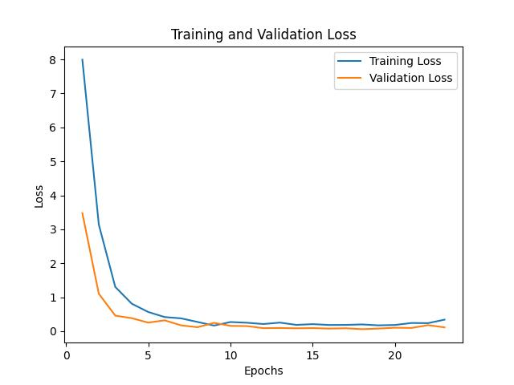

# Article GPT

Article GPT is a text generator based on a decoder-only Transformer architecture, trained on a collection of my own articles published on Medium using Pytorch Lightning. The model is designed to generate contextually relevant text in the style and content of the provided articles.

## Model Architecture

The model is a decoder-only Transformer with the following key components:

- Tokenization: Converts input text into tokens using OpenAI's [Tiktoken](https://github.com/openai/tiktoken).
- Embedding: Maps tokens to dense vectors of dimension d_model.
- Decoder Layers: Stacked layers of self-attention and feed-forward networks.
- Output Layer: Projects decoder outputs to vocabulary logits, followed by a softmax layer to obtain probabilities.

### Data
- Training data: 
  - [My own article about Neural networks 101](https://medium.com/towards-data-science/introduction-to-neural-networks-part-1-3bb27a8d314a)
  - [My own article about Apriori algorithm](https://medium.com/swlh/data-mining-a-focus-on-apriori-algorithm-b201d756c7ff)
- Validation data: 
  - A draft article, not yet published on Medium, of my own creation as well. This article covers non-linear activation functions and backpropagation.
  - An article about a [game theory](https://medium.com/swlh/understand-diners-dilemma-in-detail-479c9c577ce9)

### Key Hyperparameters
- block_size: Length of one sequence.
- d_model (embedding_dim): Dimension of the embedding and hidden states.
- num_layers (layers): Number of transformer blocks.
- num_heads (heads): Number of attention heads.
- d_k (head_size): Dimension of one attention head.
- d_ff: Dimension of the feed-forward network, hardcoded to 4 times the embedding dimension.


```bash
  | Name        | Type             | Params | Mode 
---------------------------------------------------------
0 | transformer | ModuleDict       | 123 M  | train
1 | lm_head     | Linear           | 38.6 M | train
2 | loss_func   | CrossEntropyLoss | 0      | train
---------------------------------------------------------
```

Total: 162 M Trainable params

### Training

Results using this configuration:

```bash
data:
  train: 
    path: data/train.txt
    max_samples: 100
  val: 
    path: data/val.txt
    max_samples: 100

model:
  embedding_dim: 100
  heads: 2
  head_size: 50
  block_size: 8

dataloader:
  batch_size: 2
  shuffle: True
  num_workers: 0
  #prefetch_factor: 2 # Should be >0 in case multiprocessing is enabled, i.e. num_workers > 0
  drop_last: False

trainer:
  max_epochs: 100
  num_sanity_val_steps: 1
  log_every_n_steps: 25
```

<p align="center">
  
</p>

### Test
After training for 100 epochs, the results of this gpt are still very random and do not make any sense semantically, however this is just an initial LM that i played with.
Given the presequence: [Backprppagation is], the decoder generates these outputs:
- Backpropagation is in last it should fire
- Backpropagation is in 1986 a of hidden

Obviously, this needs more data and compute power to start making sense.
